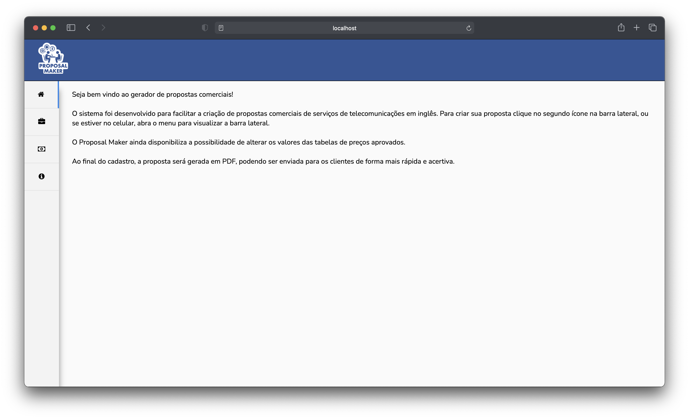
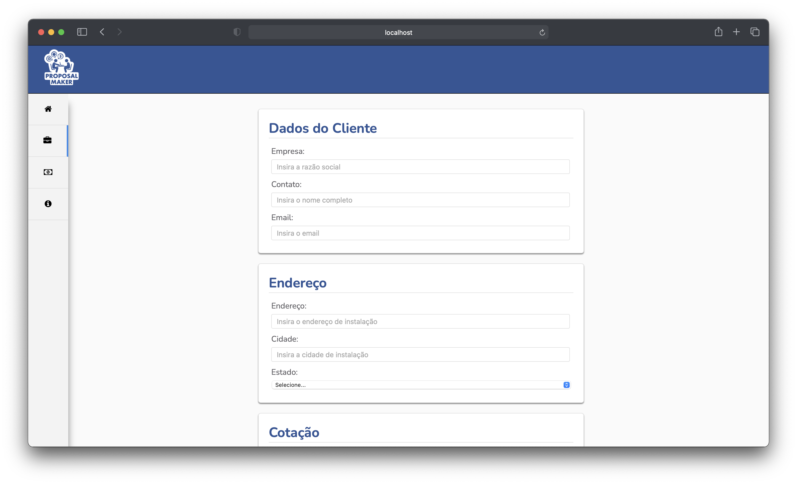
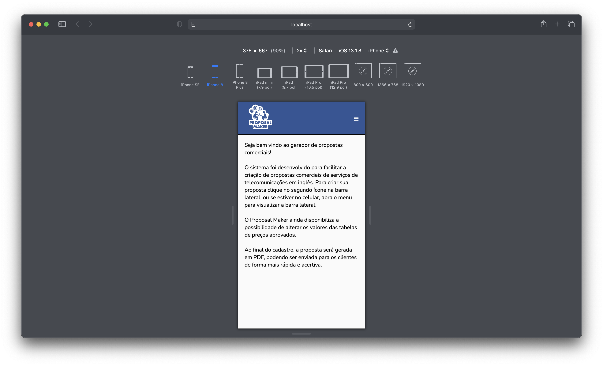
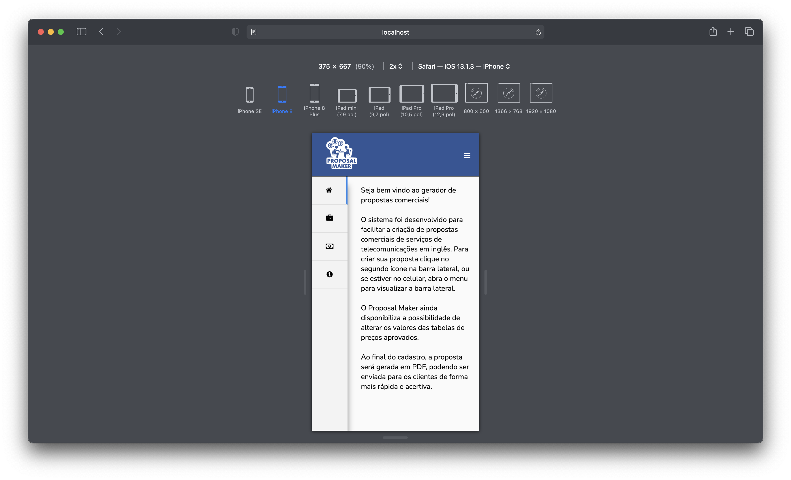
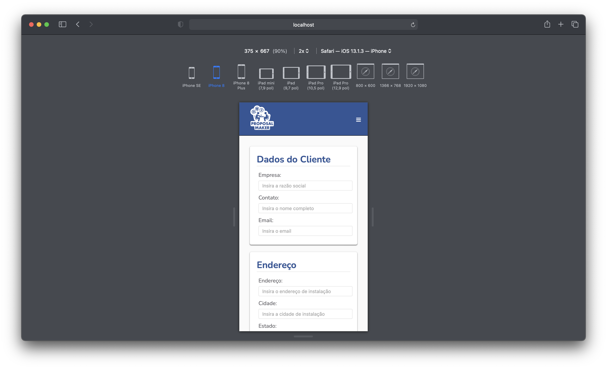

# Proposal Maker

Projeto da primeira etapa do Bootcamp do Infnet. O objetivo do projeto é introduzir o NodeJS e algumas bibliotecas para desenvolvimento Web.

## Escopo básico do projeto:

- Gerar um web app usando NodeJS e Express;
- O aplicativo deverá permitir imprimir em PDF os campos preenchidos pelo usuário no form;
- Deveremos usar CSS puro, sem nenhum tipo de SCSS;
- Não haverá consulta a banco de dados;
- A view engine será o EJS;
- O MVC será a arquitetura do programa;
- Devemos criar pelo menos dois models para gerar dinamicamente os valores de algum campo do formulário;
- O desenvolvedor deverá fazer o acompanhamento das tarefas através de um quadro no Trello compartilhado com os professores, monitores e coordenador.

## Projeto desenvolvido:

Proposal Maker foi desenvolvido para facilitar a criação de propostas comerciais de serviços de telecomunicações em inglês. O sistema funciona tanto no browser quanto no celular. O sistema disponibiliza ainda a possibilidade de alterar os valores das tabelas de preços pré aprovados através de JSON para otimizar a geração de propostas. Ao final do cadastro, a proposta será gerada em PDF, podendo ser enviada para os clientes de forma mais rápida e acertiva.

## Telas do programa:

Desktop tela inicial:

Desktop tela de cadastro:

Mobile tela inicial:

Mobile menu aberto:

Mobile tela de cadastro:

